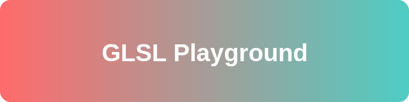

<p align="center">
  
</p>

# 🎮 GLSL Playground

GLSLシェーダーを使った実験的なビジュアルエフェクトを試すためのプレイグラウンドです。

## 🌟 特徴

- WebGLを使用したリアルタイムシェーダーレンダリング
- インタラクティブなパラメータ調整
- 事前定義された美しいシェーダーエフェクト

## 🚀 使い方

1. リポジトリをクローン：
```bash
git clone https://github.com/yourusername/glsl-playground.git
```

2. プロジェクトディレクトリに移動：
```bash
cd glsl-playground
```

3. `index.html`をブラウザで開く

## 💡 シェーダーについて

このプロジェクトには以下のシェーダーエフェクトが含まれています：

### 🌈 レインボーワープ
```glsl
GLSL for(float i,g,e,s;++i<85.;o.rgb+=hsv(g*i*.1-.5,e,s/5e2)){
    vec3 p=vec3((FC.xy-.5*r)/r.y+vec2(0,1.1),g+.1);
    p.zx*=rotate2D(t*.5);
    s=2.;
    for(int i;i++<12;p=vec3(2,5,2)-abs(abs(p)*e-vec3(5,4,4)))
        s*=e=max(1.02,12./dot(p,p));
    g+=mod(length(p.xz),p.y)/s;
    s=log2(s*.2);
}
```

このシェーダーは、ワープ効果とカラフルなグラデーションを組み合わせた視覚的効果を生成します。

## 🛠️ 技術スタック

- WebGL
- GLSL (OpenGL Shading Language)
- JavaScript
- HTML5

## 📝 ライセンス

このプロジェクトはMITライセンスの下で公開されています。

## 🤝 コントリビューション

1. このリポジトリをフォーク
2. 新しいブランチを作成 (`git checkout -b feature/amazing-effect`)
3. 変更をコミット (`git commit -am '✨ feat: 新しいエフェクトを追加'`)
4. ブランチにプッシュ (`git push origin feature/amazing-effect`)
5. プルリクエストを作成

## ✨ 謝辞

このプロジェクトは、GLSLとシェーダープログラミングのコミュニティによって支えられています。
